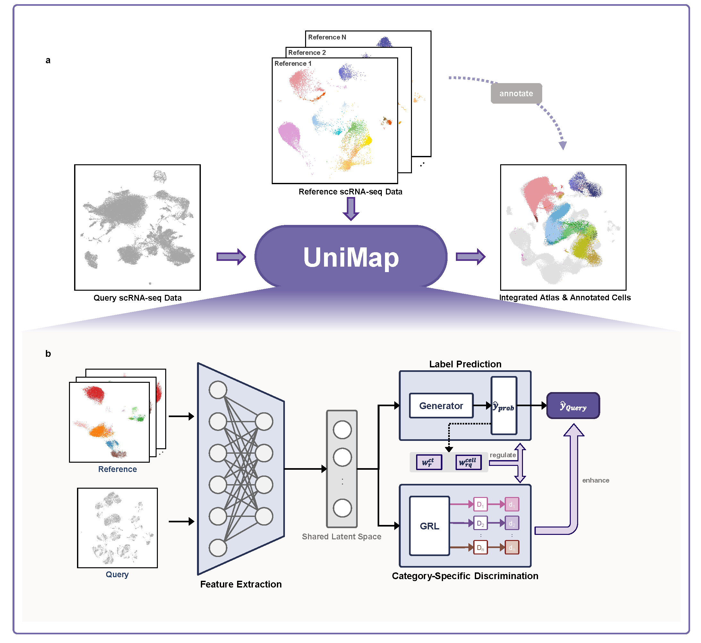

# UniMap

## 1 Introduction

**UniMap** is a multi-functional tool that leverages expert-curated scRNA-seq datasets as references to integrate, annotate, and conduct interpretable analyses on unlabeled query data.

Check out our manuscript in *Advanced Science*:

*UniMap: Type-Level Integration Enhances Biological Preservation and Interpretability in Single-Cell Annotation*



## 2 Overview

The repository is organised as follows:

- `analysis/` contains the specific analysis process of all cases;
- `benchmark_models/` contains the replication of all benchmark models
- `data/` contains all preprocessed data;
- `raw_data/` contains all raw data;
- `results/` contains the output of UniMap;
- `data_process1.py` contains simple initial processing of raw data;
- `data_process2.py` contains the necessary preprocessing of the data;
- `data_list.py` contains steps to read the data;
- `loss.py` contains each loss function of UniMap;
- `network.py` contains different modules of UniMap;
- `train_unimap.py` the main function for UniMap;
- `utils.py` contains the necessary processing subroutines.

## 3 Installation

+ The environment dependencies for **UniMap** can be downloaded from GitHub:

```
git clone git@github.com:Huahuatii/Reproducing-UniMap.git
cd Reproducing-UniMap
conda env update --f env.yml
conda activate unimap
```

## 4 Usage

### 4.1 Data

Benchmark datasets available on Google Drive need to be manually downloaded and extracted to the `data/` folder. We strongly recommend using the PBMC CVID dataset because it has a relatively small data size:

+ [PBMC CVID datasets](https://drive.google.com/file/d/1hWw0M031JMV3nplqTMmK-NHe5b4pRq1D/view?usp=drive_link)
+ [PBMC COVID-19 datasets](https://drive.google.com/file/d/1JsZYpp2xLfj4GiQKkM-JzpRXHb9lTxUh/view?usp=drive_link)
+ [PBMC MG datasets](https://drive.google.com/file/d/1U6Uha6kKYpPZcugklW6ApbUCUhMUahPP/view?usp=drive_link)
+ [Cross-species datasets](https://drive.google.com/file/d/1IdAz_70QLgZtg5q75WW8hU-boW1tRK9S/view?usp=drive_link)

### 4.2 Model Training

Before training, please ensure that you have downloaded the datasets and placed them in the correct path.

```bash
unzip data/pbmc9.zip
```

Then run the following commands to test **UniMap**:

```bash
$ python train_unimap.py --data_type pbmc9 --max_epoch 50
```

Only this one parameter needs to be changed for different datasets:

- `--data_type`: 
  - PBMC CVID dataset: `pbmc9`
  - PBMC COVID-19: `pbmc40`
  - PBMC MG: `mg`
  - Cross-species: `cross_species`

### 4.3 Result

The training code ran successfully when you see the following:

```
results/pbmc9/unimap/2023 created!

Feature in Source and Target are aligned!
Current config is: 
Namespace(model='unimap', method='union', var_name='highly_variable', need_umap=1, seed=2024, batch_size=128, latent_feature=128, tolerance=10, max_epoch=10, lr=0.0001, data_type='pbmc9', drop=0.1, conf_thres=0.9, trans_loss_w=0.5, t_loss_w=0.5, margin_w=1, epoch=25000, focal_alpha=1, focal_gamma=2, device='cuda', save_folder='results/pbmc9/unimap/2024', in_feature=1815, ce=<utils.Label_Encoder object at 0x7fa47038f670>, be=LabelEncoder(), num_classes=8, num_batches=6)
epoch:00        total_loss:-0.3942      s_loss:0.2297   t_loss:0.0003   transfer_loss:0.4793    margin_loss:-0.0063     mean_ent:1.8265 best_idx:0
epoch:01        total_loss:-0.6194      s_loss:0.0647   t_loss:0.0003   transfer_loss:0.4836    margin_loss:-0.0065     
......
epoch:09        total_loss:-0.7485      s_loss:0.0153   t_loss:0.0001   transfer_loss:0.4325    margin_loss:-0.0068     mean_ent:0.7218 best_idx:9

Calculating UMAP...
This may take a few minutes...
╭──────────── Unimap PBMC9 Train Finished ────────────╮
│ All results are saved in: results/pbmc9/unimap/2024 │
│ 1. st_result.csv                                    │
│ 2. history.csv                                      │
│ 3. best_model.pth                                   │
│ 4. st_z_result.csv                                  │
│ 5. t_prob_result.csv                                │
│ 6. st_umap_result.csv                               │
╰─────────────────────────────────────────────────────╯
```


## 4 Reproducibility

We provide [source codes](https://github.com/Huahuatii/Reproducing-UniMap/tree/master/analysis) for reproducing the experiments of the paper *UniMap*. For reproducing this part, although you do not need to download the corresponding datasets and retrain the model, you still **need to manually download the results**, extract and place them in the `results/` folder, **except for the PBMC CVID results, which are already placed in the** `results/` **folder**. Therefore, we recommend using the PBMC CVID datasets for reproduction. 

The results can be downloaded from the following Google Drive link:

+ [PBMC CVID results](https://drive.google.com/file/d/1djuNs-PsnjJZqySWgyx2Fl6DLZGt596V/view?usp=sharing) (only UniMap)
+ [PBMC COVID-19 results](https://drive.google.com/file/d/1wKoYjRCWtRh9Xm4QpSaXDX3EE6hSLm5i/view?usp=drive_link) (only UniMap)
+ [PBMC MG results](https://drive.google.com/file/d/1Ebzi4k6Qf3MTlXy-8Mr2rBWTURAljwuQ/view?usp=drive_link) (only UniMap)
+ [Cross-species results](https://drive.google.com/file/d/1wqJULRTkm0DwatavuTGEwkRTum_AiwR2/view?usp=drive_link) (only UniMap)

The reproduction code is provided below:

+ [Benchmarking of PBMC CVID datasets](https://github.com/Huahuatii/Reproducing-UniMap/tree/master/analysis/case2).
+ [Integration and annotation of PBMC COVID-19 datasets](https://github.com/Huahuatii/Reproducing-UniMap/tree/master/analysis/case3).
+ [Integration and annotation of PBMC MG datasets](https://github.com/Huahuatii/Reproducing-UniMap/tree/master/analysis/case4).
+ [Integration and annotation of Cross-species datasets](https://github.com/Huahuatii/Reproducing-UniMap/tree/master/analysis/case5).

## 5 Development

This framework is developed by Haitao Hu (22260236@zju.edu.cn)


